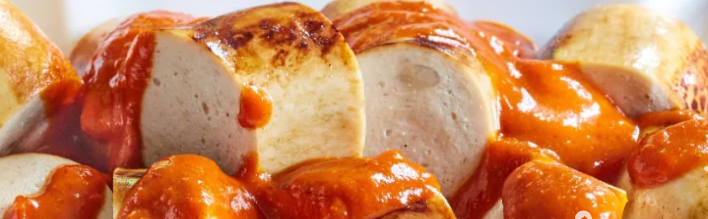
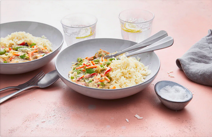

#Rezepte


## Rezept 1

**==Zutaten und Zubereitung==**

> 

```
- 1 Zwiebel
- 2 EL Pflanzenöl
- 2 TL Currypulver
- 1 TL Paprikapulver edelsüß
- 2 EL Tomatenmark
- 1 TL KNORR Delikatess Brühe (Dose)
- 1 TL Zucker
- 3 EL KNORR Tomaten Ketchup
- Cayennepfeffer
- 3 Bratwürste
```


1. Zwiebel schälen und fein hacken. Zwiebel in einem Topf in 1 EL Öl dünsten. Currypulver und Paprikapulver zufügen und anschwitzen lassen. Tomatenmark zufügen und untermischen.
2. 300 ml Wasser zugießen und Knorr Delikatess Brühe einstreuen. Zucker und Knorr Tomaten Ketchup zufügen und 15 Minuten bei mittlerer Hitze kochen. Sauce nach Belieben mit einem Stabmixer pürieren. Mit Cayennepfeffer abschmecken.
3. Bratwüste im restlichen heißen Öl rundherum braten. In Stücke schneiden und mit der Currysauce servieren. 


## Rezept 2

**==Zutaten Zubereitung==**

> 

1. 
   ` 750 g REWE Beste Wahl Wok-Mix` 
Wokmischung aus der Tiefkühltruhe nehmen und kurz antauen lassen. 
2. 
    `240 g Reis • Salz` 
Reis nach Packungsanweisung in Salzwasser kochen. 
3. 
    `20 g frischer Ingwer` 
Ingwer waschen, schälen und fein hacken.
4. 
    `1 EL Öl `
Öl in einer Pfanne erhitzen und Ingwer kurz darin anbraten. Wokgemüse dazugeben und kurz anbraten.
5. 
    `3 EL Erdnussbutter • 400 ml Kokosmilch `
Erdnussbutter mit dem Gemüse vermengen und mit Kokosmilch ablöschen. Kurz aufköcheln lassen und zum Reis servieren. 